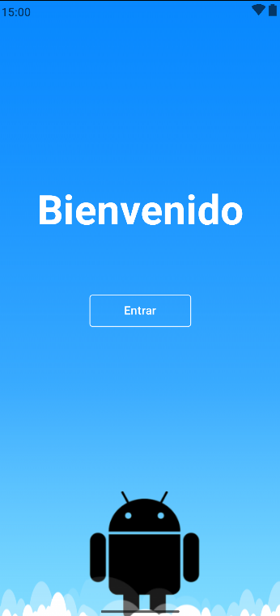
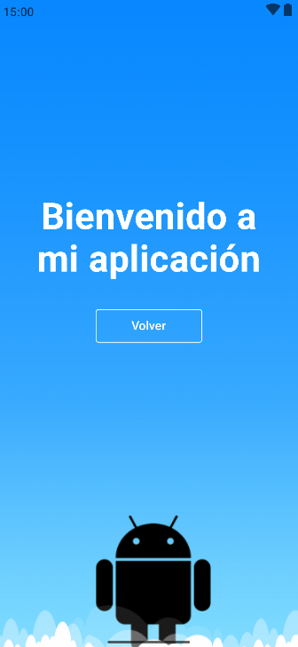

# 📱 MultiLangBackgroundApp

Aplicación Android desarrollada en **Kotlin** usando **Jetpack Compose**, con soporte **multilenguaje** y un fondo personalizado tipo **nine-patch** para mantener proporciones sin distorsión.  
El proyecto está diseñado para adaptarse a **múltiples idiomas**, orientaciones de pantalla y tamaños de dispositivos.

---

## 🌟 Características principales
- 🌐 **Idiomas soportados**: Español (predeterminado), Inglés, Francés y Alemán.
- 🖼 **Fondo nine-patch**: El personaje y elementos gráficos mantienen sus proporciones al redimensionar.
- 📱 **Diseño responsivo**: Adaptación automática para **portrait**, **landscape** y pantallas grandes (tablets).
- 🎨 **Temas y estilos** gestionados con Compose.
- 🧩 **Buenas prácticas** en organización de recursos (`values-xx`, drawables, etc.).

---

## 📋 Requisitos
- Android Studio Giraffe o superior.
- Gradle wrapper incluido (no requiere instalación externa).
- JDK 17 o superior.

---

## 🚀 Ejecución del proyecto

1. **Clonar el repositorio**:
   ```bash
   git clone https://github.com/ingmarcela27/MultiLangBackgroundApp.git
   cd MultiLangBackgroundApp

2. Abrir en Android Studio:

- Menú: File > Open y seleccionar la carpeta del proyecto.

- Esperar a que Gradle sincronice.

Ejecutar:

- Seleccionar un dispositivo/emulador.

- Pulsar el botón Run ▶️.

---

🌐 Cambio de idioma
La app detecta automáticamente el idioma configurado en el sistema.
Para cambiarlo:

- En Android: Configuración > Idioma > Seleccionar idioma.

- Reinicia la app para ver los textos actualizados.

---

🖼 Detalles del nine-patch

- Ubicación: app/src/main/res/drawable/background_custom.9.png

- Bordes:

  - Izquierdo y superior: definen zonas de estiramiento.

  - Derecho e inferior: definen el área de contenido.

El área del personaje no se distorsiona al cambiar tamaño.

---

🖥 Soporte para múltiples pantallas
- Uso de BoxWithConstraints y medidas relativas.

- Ajustes dinámicos según orientación (portrait/landscape).

- Compatibilidad con pantallas grandes (tablets).

---

## 📱 Capturas de pantalla

### Pantalla 1


### Pantalla 2


---

## 📦 APK listo para instalar  
Puedes descargar el APK desde la sección de [Releases](https://github.com/ingmarcela27/MultiLangBackgroundApp/releases) del repositorio.


